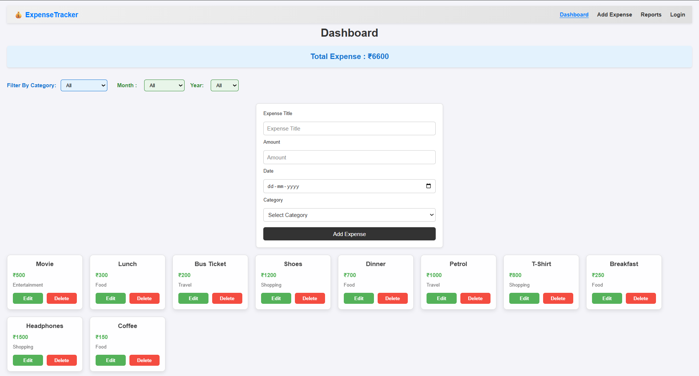
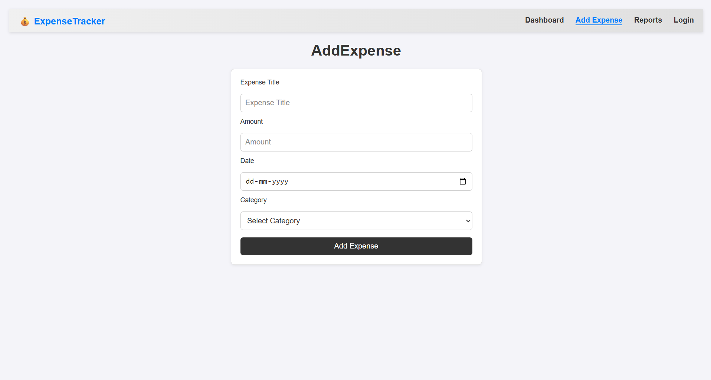
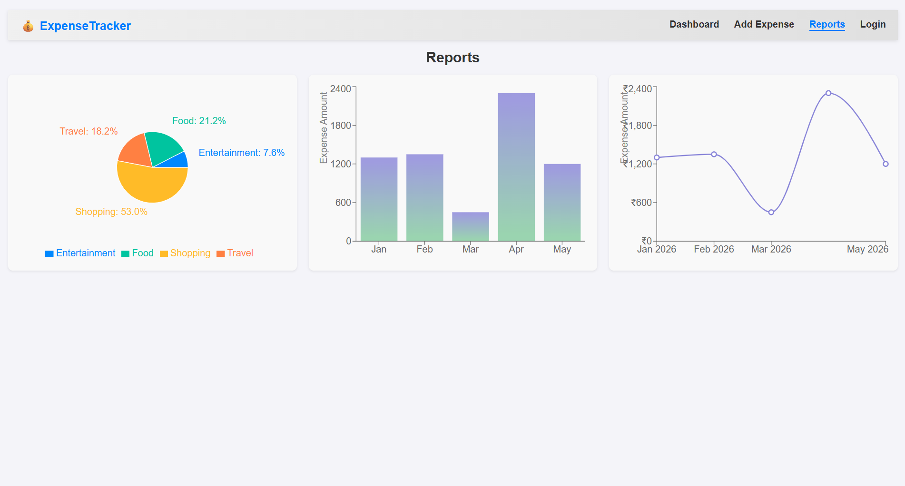
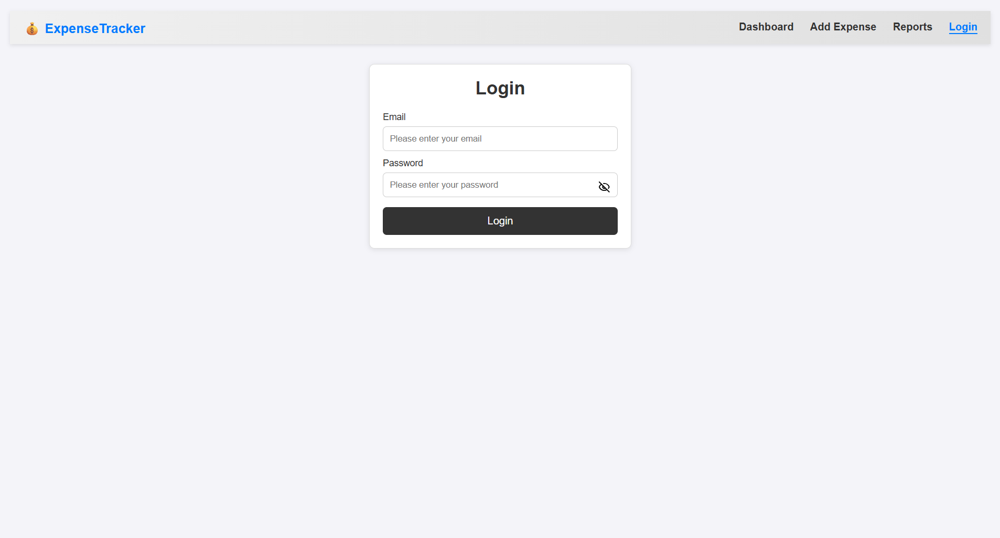

# Expense Tracker

A responsive React-based expense tracking application that allows users to add, edit, delete, filter, and analyze their expenses through a simple and intuitive interface.

## Features

- Add and manage expenses
- Edit existing expenses
- Delete expenses with confirmation
- Filter expenses by category, month, and year
- View total expense summary
- Expense reports with charts
- Responsive design for desktop and mobile
- Frontend login interface

## Tech Stack

- React.js
- React Router
- JavaScript (ES6+)
- CSS3
- Recharts
- Lucide React
- Vite

## Application Overview

The Expense Tracker is designed to provide a simple way to manage daily expenses from a single interface.

Users can add new expenses by entering the title, amount, date, and category. Existing expenses can be edited or deleted, with a confirmation step before deletion.

The dashboard also provides filtering options by category, month, and year, while the Reports section presents expense data through visual charts for easier analysis.

## Getting Started

### Prerequisites

Make sure you have the following installed on your system:

- Node.js
- npm

### Installation

Clone the repository and install the project dependencies:

```bash
git clone https://github.com/saikirantalasila/expense-tracker.git
cd expense-tracker
npm install
```

### Running the Project

Start the development server:

```bash
npm run dev
```

The application will be available at the local development URL provided by Vite.

## Project Structure

```text
expense-tracker/
├── public/
├── src/
│   ├── assets/
│   ├── components/
│   ├── data/
│   ├── pages/
│   ├── App.jsx
│   └── main.jsx
├── screenshots/
│   ├── dashboard.png
│   ├── expense-form.png
│   ├── login.png
│   └── reports.png
├── package.json
├── vite.config.js
└── README.md
```

## Screenshots

### Dashboard



### Add / Edit Expense



### Reports



### Login



## Current Limitations

- Expense data is stored only in the application's runtime state and is reset when the page is refreshed.
- Authentication is currently implemented as a frontend demo interface and does not provide real user authentication.

## Future Improvements

- Add persistent data storage using a backend and database
- Implement secure user authentication
- Add advanced expense analytics and reporting
- Introduce additional filtering and sorting options
